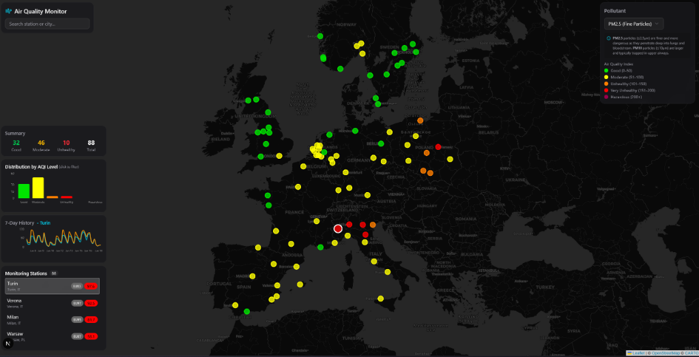

# GeoVis Portal

A geographical data visualization platform for environmental monitoring and analysis. The application provides interactive dashboards for earthquake monitoring, weather stations, air quality indices, and bird sighting data.



## Architecture

The project consists of two main components:

- Backend: Java servlet-based REST API running on Tomcat 9 (Gradle/Gretty)
- Frontend: Next.js 16 application with React 19, TypeScript, and Tailwind CSS

## Prerequisites

- Java 11 or higher (JDK)
- Node.js 18 or higher
- npm or yarn

## Quick start

### 1. Start the backend

```bash
# From the project root directory
./gradlew tomcatRun
```

The backend will start on `http://localhost:8081`.

### 2. Start the frontend

```bash
# Navigate to the frontend directory
cd frontend

# Install dependencies
npm install

# Start development server
npm run dev
```

The frontend will start on `http://localhost:3000`.

## Backend API endpoints

| Endpoint | Method | Description | Parameters |
|----------|--------|-------------|------------|
| `/mapdata` | GET | Earthquake data from KNMI | `limit` (default: 10) |
| `/weatherdata` | GET | Weather stations with live data | `nstations` (default: 100), `country` |
| `/stationdownload` | GET | Weather stations only | `nstations` (default: 1000) |
| `/airqualitydata` | GET | Air quality for European cities | None |
| `/birddata` | GET | Bird sightings from eBird | `region`, or `lat`, `lng`, `dist` |

### Example requests

```bash
# Get 50 recent earthquakes
curl http://localhost:8081/mapdata?limit=50

# Get weather data for Germany
curl http://localhost:8081/weatherdata?country=DE

# Get bird sightings in the Netherlands
curl http://localhost:8081/birddata?region=NL

# Get bird sightings near coordinates
curl http://localhost:8081/birddata?lat=52.1&lng=5.3&dist=25
```

## Frontend pages

| Route | Description |
|-------|-------------|
| `/` | Home portal with links to all dashboards |
| `/earthquake` | Earthquake monitoring with interactive map and depth visualization |
| `/weather` | Global weather station data with temperature and wind information |
| `/airquality` | Air quality index dashboard with PM2.5, NO2, and ozone tracking |
| `/birds` | Biodiversity maps with bird sighting heatmaps |
| `/benchmark` | System benchmark tool |

## Configuration

### Backend configuration

The backend runs on port 8081 by default. To change this, edit `build.gradle`:

```groovy
gretty {
    httpPort = 8081  // Change this value
}
```

### Frontend configuration

The frontend connects to `http://localhost:8081` by default. To change the API URL, create a `.env.local` file in the `frontend` directory:

```
NEXT_PUBLIC_API_URL=http://your-api-url:port
```

### eBird API key (Optional)

The bird sightings feature requires an eBird API key for full functionality. You can obtain one from the [eBird API documentation](https://documenter.getpostman.com/view/664302/S1ENwy59).

Set the API key using an environment variable:

```bash
export EBIRD_API_KEY=your_api_key_here
```

Alternatively, configure it in `src/main/webapp/META-INF/context.xml`.

## Project structure

```
map_project/
├── build.gradle              # Backend build configuration
├── gradlew                   # Gradle wrapper (Unix)
├── gradlew.bat               # Gradle wrapper (Windows)
├── src/main/
│   ├── java/nl/bioinf/jscscheper/tool/
│   │   ├── config/           # CORS filter, API response utilities
│   │   ├── model/            # Data models (Earthquake, Station, etc.)
│   │   ├── service/          # Data fetchers for external APIs
│   │   ├── servlets/         # REST API endpoints
│   │   └── util/             # Utility classes
│   └── webapp/
│       ├── META-INF/         # Tomcat context configuration
│       └── WEB-INF/          # Web resources and station data
├── frontend/
│   ├── src/
│   │   ├── app/              # Next.js pages and routes
│   │   ├── components/       # React components
│   │   ├── hooks/            # Custom React hooks for data fetching
│   │   ├── lib/              # Utilities and API configuration
│   │   └── types/            # TypeScript type definitions
│   ├── package.json          # Frontend dependencies
│   └── tsconfig.json         # TypeScript configuration
└── README.md
```

## Tech stack

### Backend
- Java 11+
- Servlet API 4.0
- Gson (JSON processing)
- Apache HttpClient 5
- Tomcat 9 (via Gretty)

### Frontend
- Next.js 16 (App Router)
- React 19
- TypeScript
- Tailwind CSS
- shadcn/ui (component library)
- react-leaflet (maps)
- recharts (charts)
- SWR (data fetching)

## Development

### Running tests

```bash
# Backend tests
./gradlew test
```

### Production build

```bash
# Build frontend for production
cd frontend
npm run build
npm start

# Build backend WAR file
./gradlew war
```

### CORS configuration

The backend includes a CORS filter (`CorsFilter.java`) that allows requests from `localhost:3000` for local development. Modify this file if deploying to different origins.
